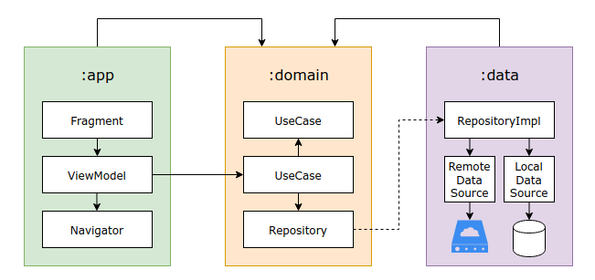

# Cornershop Android Development Test

## Some notes

I am not the best UI/UX guy, so I tried to show my architecture, libraries and design pattern knowledge at most of the time.

Each of the features has its on [branch](https://github.com/bfpimentel/cornershop/branches) and almost of them are mapped inside the issue [Feature Roadmap](https://github.com/bfpimentel/cornershop/issues/1). I followed the [**conventional**](https://www.conventionalcommits.org/en/v1.0.0/) [commits messages](https://github.com/bfpimentel/cornershop/commits/develop).

The code coverage tool that I use ([codecov.io](https://codecov.io/)) was not working properly, I couldn't see any coverage reports in the web app, so I tried to cover at least 80% of code looking on the basic report.

## A decision I made and my motivation

I refactored the server to follow a offline-first way to persist data. Why?

- I thought the way of how the API was done was not performatic, the needing of increasing and decreasing one by one was a big bottleneck.
- I made the application to be as non obstructive as possible, so I removed the individual increasing and decreasing endpoints and created a sync endpoint, which is called in background at a debounce of 5 seconds on any method that update or create a counter.
- So, the app is responsible for creating and storing all the counters. Fetching the counters already on the server is done just one time.
- That is something that I would do in a day-to-day basis, I'd talk to the back-end, to the product owners and discuss if it would be a good feature to have.
- I don't think that's way more complex or way more easier to do than what was purposed, so I would show the same skills one way or another.

I know I may lose points with this decision, but when "Thinking I'm building it to publish for the Google Play Store", I thought that was the best way to go.

## Running the Application

1. Clone repository
2. Start server
   ```
   $ cd server
   $ npm install
   $ npm start
   ```
3. Run Android project in Android Studio

## Architecture Explanation

I choose to modularize just the project layers instead of the features because there were just two screens and there are no plans to add more. I focused on ease to maintain and on Clean Architecture principles.

<p align="middle">
    
    <p style="text-align:center"><i>This is a representation of the architecture, the connection between UseCases is not obligatory, more details below.</i></p>
    <p style="text-align:center"><i>The arrows on the top can be read as "talks to".</i></p>
</p>

### :app

This is the presentation layer, it is responsible for what the user sees.

- **Fragment**: The Fragment is responsible to listen to the user inputs and its ViewModel outputs.
- **ViewModel**: It expects the Fragment inputs and calls the UseCases, from _domain_ module, then, it can output the data to the Fragments via LiveData observers. All the ViewModels in this project also have a Navigator.
- **Navigator**: It navigates or pops to other fragments.

---

### :domain

This is the domain layer, it holds the business rules of the applications and it is a pure java/kotlin module.

- **UseCase**: It is responsible for the business rules on the application, it talks to the repositories by dependency inversion or to another use cases.

---

### :data

This is the data layer, it does not contain any business rules, it is responsible to get data from local or remote data sources.

- **Repository**: It is just a composition of local or remote data sources, the interfaces on those are from the _domain_ module.
- **DataSource**: It is responsible to talk with the remote server or local database.

## API Endpoints & Examples

```
GET /api/v1/counters
# []


PUT /api/v1/counters/sync
Request Body:
# {
#   "deletedCounterIds": [],
#   "counters": [
#     { "id": "-MZ-CFVG--8LbqVX2LaM", "title": "Cupcakes eaten", "count": 3 }
#   ]
# }

Response Body:
# [
#   { "id": "-MZ-CFVG--8LbqVX2LaM", "title": "Cupcakes eaten", "count": 3 }
# ]


PUT /api/v1/counters/sync
Request Body:
# {
#   "deletedCounterIds": [ "-MZ-CFVG--8LbqVX2LaM" ],
#   "counters": [
#     { "id": "-MZ-DTl7e7urGjlsAt3X", "title": "Tequila shots", "count": 30 }
#   ]
# }

Response Body:
# [
#   { "id": "-MZ-DTl7e7urGjlsAt3X", "title": "Tequila shots", "count": 30 }
# ]
```
